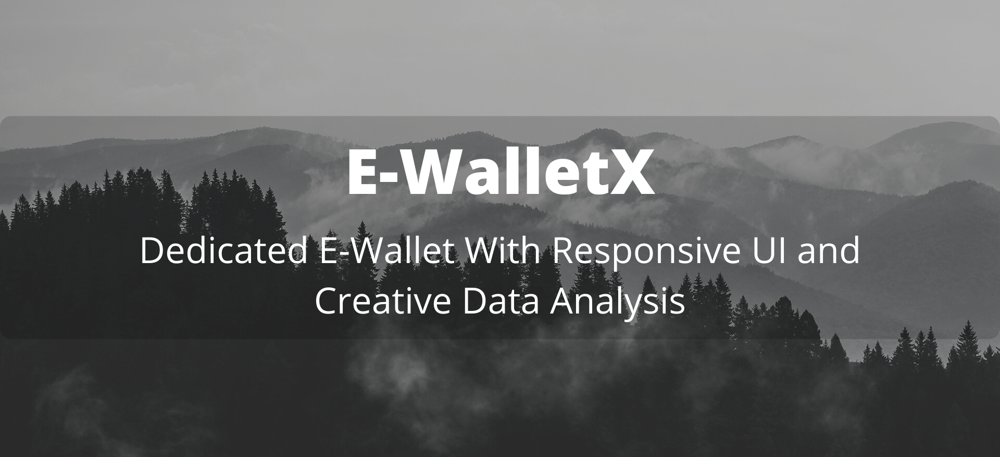

# Wallet-X 💳
<p align="center">
   
</p>

You can Install and test Wallet-X webapp from below 👇

<p>
  
  
</p>

<!-- ABOUT THE PROJECT -->

## 🚩Team Members

- [Sandipan Das](#)
- [Vedansh Vijaywargiya](#)

## 🏹Submitted to : MLH Backyard Hacks 2.0

## 🚀 Built With

- **Frontend**
  - [CSS](https://www.w3schools.com/css/): Style sheet language used for describing the presentation of a document written in a markup language such as HTML
  - [Vanilla JS](https://snipcart.com/blog/learn-vanilla-javascript-before-using-js-frameworks): Refers to the pure JavaScript (or we can say plain JavaScript) without any type of additional library
  - [Bootstrap](https://getbootstrap.com/): Free and open-source CSS framework directed at responsive, mobile-first front-end web development
- **Backend**
  - [Node.js](https://nodejs.org/en/): Open-source, cross-platform, back-end JavaScript runtime environment that runs on the V8 engine
  - [Express.js](https://expressjs.com/):  Minimal and flexible Node.js webapp framework that provides a robust set of features for web and mobile applications.
  - [EJS Templates](https://ejs.co/):  Simple templating language that lets you generate HTML markup with plain JavaScript.
- **Libraries**
  - [Chart.js](https://www.chartjs.org/): Simple, clean and engaging HTML5 based JavaScript charts.
  - [JSPdf](https://www.npmjs.com/package/jspdf): A library to generate PDFs in JavaScript.
  - [Mongoose ODM](https://mongoosejs.com/): Mongoose provides a straight-forward, schema-based solution to model our application data.
  - [Passport](http://www.passportjs.org/) + [Google OAuth2.0](http://www.passportjs.org/packages/passport-google-oauth/): Authentication middleware for Node.js.
- **Database**
  - [MongoDB Atlas](https://www.mongodb.com/cloud/atlas): Source-available cross-platform document-oriented database program.

## 🍳 Notable Features

- Support for NodeJS Authentication Strategy using Google Oauth2.0
- Support for basic expenditure and income tracking
- Dedicated support for expense deletion (DELETE operation) from MongoDB Atlas
- Dedicated tabular representation for daily transactions using Bootstrap
- Graphical representation of transaction trend with categorical analysis in Chart.js
- Fully responsive web application user interface.

## Major Updates

- [X] Integrated location-based expense tracking trend on a digitaly rendered map
- [X] Added pdf-based report generation functionality in JS
- [X] Integrated file-based receipt upload functionality with database logging
- [X] Support for categorical analysis in Chart.js
- [X] Added location-based expense logging and real-time map rendering using Google Maps API
- [X] Added date filtering on expenses table

## 🚩 How to Install Locally

**1. Fork and clone this repository using**

   ```
   git clone https://github.com/sandip2224/Wallet-X.git
   cd Wallet-X/
   ```  
   
**2. Install required dependencies and dev dependency using**  

   ```
   npm install
   npm install -D nodemon
   ```  

**3. Create a config.env file inside the `/config` directory and add the following**

   ```bash
   MONGO_URI=<Your_Unique_MongoDB_Cluster_URI>
   GOOGLE_CLIENT_ID=<Your_Unique_Google_Client_ID>
   GOOGLE_CLIENT_SECRET=<Your_Unique_Google_Client_Secret>
   API_KEY=<Your_Google_Cloud_Console_Api_Key>
   ```  
 **4. Start the server locally using**

   ```bash
   npm run dev
   ```  
   **or in production mode using**
   ```bash
   npm run start
   ```  
<div align="center">
  
</div>

---

## Discuss 💬

Have any questions, doubts or want to present your opinions, views? You're always welcome. You can [start discussion](https://github.com/sandip2224/Wallet-X/discussions).

## 🥢 Contact
If you need any help, you can connect with me.

Visit: [sandip2224](https://linkedin.com/in/sandipan0164/)
